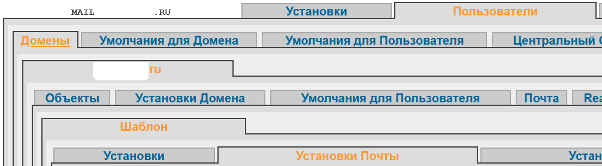
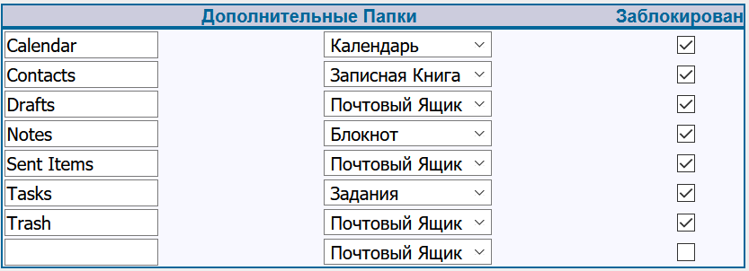

## Синхронизация по ActiveSync ( протокол Exchange) -  Reverse Proxy с использованием  nginx  
[По мотивам1](https://blog.kempkens.io/posts/exchange-reverse-proxy-using-nginx/)  
[По мотивам2](https://stackoverflow.com/questions/14839712/nginx-reverse-proxy-passthrough-basic-authenication/19714696#19714696)  
[По мотивам3](https://stackoverflow.com/questions/35384245/nginx-as-exchange-proxy)  

Для корректной работы по протоколу Microsoft для синхронизации клиентов по **ActiveSync** (в терминологии CommunigatePro называется AirSync) необходимо для нового пользователя создавать папки:  
- Calendar  
- Contacts  
- Drafts  
- Notes  
- Sent Items  
- Tasks  
- Trash

## Для существующих пользователей необходимо создать недостающие папки - выполнить команду   
```
find <путь до папки, где хранятся почтовые ящики> -name "*.macnt" -exec <путь до скрипта>/create_folders.sh {} \;
```
Скрипт create_folders.sh
```
#!/bin/sh

echo Folder \"$1\"
echo "Press Ctrl+^C for stop..."
sleep 2

create_folder (){
  mkdir "$1/$2" && echo Create folder  \"$2\"
if [ $? -eq 0 ]
then
  echo '   done.'
fi
}

echo Create folders in \"$1\"
create_folder $1 Calendar.mslc
create_folder $1 Contacts.mslc
create_folder $1 Drafts.mslc
create_folder $1 Notes.mslc
create_folder $1 'Sent Items.mslc'
create_folder $1 Tasks.mslc
create_folder $1 Trash

exit 0
```
## Для новых пользователей добавить в шаблон создание необходимых папок  
*Пользователи\Домены\<Название домена>\Шаблон\Установки почты* 


раздел *Дополнительные Папки*


```
server {
    listen   443 ssl;
    server_name airsync.foo.bar.ru;
    # максимальный размер файла
    client_max_body_size 100M;

    root /srv/docroot/;
    ssl_certificate         SSL_CERT;
    ssl_certificate_key     SSL_KEY;
    ssl_trusted_certificate SSL_CHAIN_CERT;
    ssl_session_timeout     5m;

    location ^~ / {
      proxy_pass   http://a.aa.aaa.aaaa:aaaaa/;
      proxy_pass_request_headers on;
      proxy_connect_timeout       600;
      proxy_send_timeout          600;
      send_timeout                600;
      proxy_buffering off;
      proxy_http_version 1.1;
      proxy_set_header X-Forwarded-For $proxy_add_x_forwarded_for;
      proxy_set_header Upgrade $http_upgrade;
      proxy_set_header Connection $http_connection;
      proxy_read_timeout 3600;
      proxy_pass_header Date;
      proxy_pass_header Server;
      proxy_pass_header Authorization;
  }

}
```
